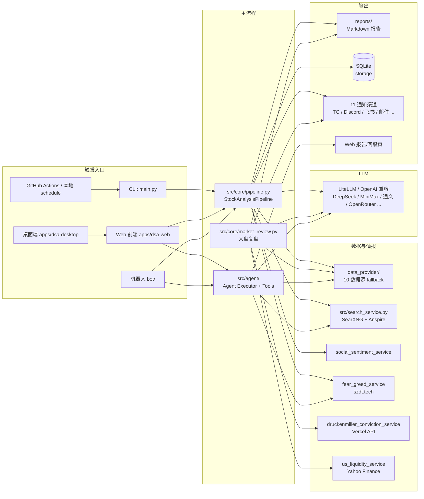

# 能力总览 / Capabilities Map

> 本文件汇总自选股智能分析系统**当前**所具备的能力，按"用户触发面 → 内部模块 → 数据/外部依赖"组织。
>
> **目的**：
> 1. 让维护者快速回忆系统的边界与扩展点
> 2. 给未来加入的 AI Agent / 新人提供单点入口
> 3. 给 PR / Issue / 设计讨论提供参考基线
>
> **维护原则**：
> - 改了用户可见能力（CLI / API / 报告结构 / 通知 / 策略）时，**同步本文件**与 `docs/CHANGELOG.md`
> - 本文件不重复 README.md 的"如何运行"，只描述"系统能做什么、由哪些模块组成"
> - 当某个主题（比如 Agent Tools / Strategies）长到 200+ 行时，独立拆分为 `docs/capabilities/<topic>.md`，本文件保留导航条目即可

---

## 一、一句话定位

**多市场覆盖（A 股 / 港股 / 美股）的自选股智能分析系统**，通过"多数据源 fallback → 技术分析与新闻情报 → LLM Agent 决策 → 多渠道通知"主流程提供分析能力，配套 Web、桌面端、机器人入口与回测、组合管理工具。

---

## 二、整体架构地图



---

## 三、触发入口

| 入口 | 命令 / 路径 | 用途 | 备注 |
|---|---|---|---|
| **CLI 一次性分析** | `python main.py` | 跑 `STOCK_LIST` + 大盘复盘 + 推通知 | 全量主流程 |
| **CLI 仅大盘** | `python main.py --market-review` | 仅大盘复盘（A 股 / 美股按 `MARKET_REVIEW_REGION`） | |
| **CLI 调试模式** | `python main.py --debug` / `--dry-run` | dry-run 不调 LLM，--debug 详细日志 | |
| **CLI 定时任务** | `python main.py --schedule` | 本地 schedule 库守护进程，关机即失效 | |
| **CLI 启 Web** | `python main.py --serve` / `--serve-only` | `--serve` 启动 + 跑批量；`--serve-only` 只起 Web | 推荐 `--serve-only` 平时调试 |
| **CLI 回测** | `python main.py --backtest [--backtest-code XXX]` | 评估历史分析结果 | |
| **Web 前端** | `apps/dsa-web/`（构建到 `static/`，由 `--serve` 提供） | 问股 / 立即分析 / 报告 / 组合 / 设置 | React + Vite + Tailwind |
| **桌面端** | `apps/dsa-desktop/` | Electron 打包 Web 前端，支持单机使用 | |
| **机器人** | `bot/commands/` (Discord / Telegram / 飞书 等) | 对话式触发 | 11 个命令见下 |
| **GitHub Actions** | `.github/workflows/daily_analysis.yml` | 每日定时分析（cloud，不依赖本机开机） | 7:30 / 21:00（UTC）双 cron |
| **API 直调** | `POST /api/v1/analysis/analyze` | 程序化触发 | FastAPI |

CLI 全部参数见 `main.py:222-358`，重点：

```
--stocks 600519,AAPL    # 临时指定股票列表
--no-notify             # 不推通知
--single-notify         # 单股分析完就推
--force-run             # 跳过交易日检查
--no-market-review      # 跳过大盘复盘
--workers N             # 并发线程数
```

---

## 四、Skills（策略）清单 — 28 个定义 / 26 个用户可见

YAML 路径：`strategies/*.yaml`，前端通过 `GET /api/v1/agent/skills` 自动加载 `user_invocable: true` 的技能。目前 `ema5_200_setup` 作为用户可见的 `EMA200回踩` 入口，底层使用 SPY_ORB_EMA200_v2 的 5m RTH ORB + EMA200 顺势逻辑；`vcp_h1_h2_buy` 对应 VCP_H1_H2_BUY 日线指标；`vcp_breakout_trader` 对应 VCP_BREAKOUT_TRADER 日线突破交易员指标；`ema_200_highlow` 和 `nunu_wave` 保留定义和底层能力，但暂不在问股 / 策略选择中展示。

选择规则：`multi_strategy_consensus` 是自带 12 项子策略和严格汇总格式的元 skill，因此与其他专项 skill 互斥。Web 默认勾选它时，改选 Serenity 投研、价值投资等专项框架会自动取消元 skill；反向选择元 skill 会清空已有专项组合。专项 skill 仍可最多组合 3 个，后端会按用户选择顺序生成执行计划、去重汇总必要工具，并要求每个 skill 分别产出结果后再综合。API/旧客户端若同时传入元 skill 与专项 skill，后端保留专项 skill 并丢弃元 skill，避免严格输出格式互相覆盖。

| # | id | 显示名 | 默认优先级 | 类别 | 用途简介 |
|---|---|---|---|---|---|
| 1 | `five_dimension_analysis` | 五维分析 | 4 | framework | 基本面、技术面、消息面、情绪面、期权结构五维共振；缺少期权/情绪数据时显式降级 |
| 2 | `multi_strategy_consensus` | ⚡ 多策略联合 | 5 | framework | **元 skill**：调用 12 个子策略逐项打分，输出表格 + 加权综合得分 + 决策映射（前端默认勾选） |
| 3 | `bull_trend` | 默认多头趋势 | 10 | trend | 后端 `default_skill_id`：MA5>MA10>MA20 + MACD 金叉，关注 7 条核心交易基线 |
| 4 | `ma_golden_cross` | 均线金叉 | 20 | trend | MA5 上穿 MA10 + 量能放大 / DIF 上穿 DEA |
| 5 | `serenity_research` | Serenity投研 | 24 | framework | 读取公开研报/评级更新并套用 Serenity 买方 memo、增长概率、TAM-Adj-PEG、GF-DMA 和 news-to-financial-statement 交叉验证 |
| 6 | `value_investing` | 💎 价值投资 | 25 | framework | 巴菲特式长期视角：PE/PB 历史分位 + 护城河三重检验 + 价值选股加分项 + 退出纪律 |
| 7 | `quality_compounder` | 🚀 高质量复利 | 28 | framework | Peter Lynch / Terry Smith 风格：ROE 持续性 + 营收 CAGR + 毛利率 + GARP |
| 8 | `volume_breakout` | 放量突破 | 30 | trend | 突破 20 日新高 + 量比确认 |
| 9 | `valuation_model` | 📐 估值模型 | 30 | framework | PE/PS 历史分位 + 成长质量 + 产业链景气三因子综合定级 |
| 10 | `fear_greed_sentiment` | 😱 贪恐情绪 | 30 | sentiment | 基于 szdt.tech 贪恐分（-100~100）的逆向情绪分析 |
| 11 | `ema5_200_setup` | EMA200回踩 | 32 | pattern | 基于 SPY_ORB_EMA200_v2 的 5m RTH ORB + EMA200 顺势信号，输出多/空信号、自适应过伸过滤、ORB 区间和手动防守纪律 |
| 12 | `ema_200_highlow` | ema_200_highlow | 33 | pattern | 暂隐藏；EMA200 reclaim 后检查 higher low / 双底、结构止损与 1R 空间，输出 0-3 结构等级 |
| 13 | `vcp_h1_h2_buy` | VCP H1/H2 | 34 | pattern | 基于 VCP_H1_H2_BUY 日线指标，输出 VCP 准备区、枢轴突破、H1/H2 和 BUY 去重判断 |
| 14 | `vcp_breakout_trader` | VCP突破交易员 | 35 | pattern | 基于 VCP_BREAKOUT_TRADER 最终优化版日线指标，输出 VCP/牛旗准备区、LC、突破 BUY、过度延展、10%风险过滤与结构失败判断 |
| 15 | `hot_theme` | 热点题材 | 35 | framework | 政策、产业和市场热点强度、扩散阶段与个股相对强弱判断 |
| 16 | `dividend_growth` | 💵 股息成长 | 35 | income | 股息率 + payout 健康度 + 连续增息年数 + FCF 覆盖 |
| 17 | `shrink_pullback` | 缩量回踩 | 40 | trend | 回踩 MA5/10 不破 + 缩量企稳 |
| 18 | `event_driven` | 事件驱动 | 45 | framework | 业绩、政策、并购、订单、产品发布等事件催化评估 |
| 19 | `box_oscillation` | 箱体震荡 | 50 | framework | 区间震荡：下沿低吸、上沿减仓 |
| 20 | `growth_quality` | 成长质量 | 55 | framework | 收入利润增长、ROE、现金流和行业空间的成长质量判断 |
| 21 | `bottom_volume` | 底部放量 | 60 | reversal | 周线底部 + 日线放量 + 长下影 |
| 22 | `expectation_repricing` | 预期重估 | 65 | framework | 业绩、政策和估值预期变化下的预期差修复或过热风险 |
| 23 | `chan_theory` | 缠论 | 70 | framework | 中枢 / 背驰 / 三买信号 |
| 24 | `wave_theory` | 波浪理论 | 80 | framework | 5 浪推进 + ABC 调整识别 |
| 25 | `nunu_wave` | nunu波浪 | 81 | framework | 暂隐藏；保留级别优先的进阶波浪框架：阶段四问、复杂调整、跨级别楔形、截尾五浪、序列日/共振日、主备计数切换与失效位优先 |
| 26 | `dragon_head` | 龙头策略 | 90 | trend | 板块强势 + 个股领涨 |
| 27 | `emotion_cycle` | 情绪周期 | 100 | framework | 市场情绪冷热周期，逆向布局 |
| 28 | `one_yang_three_yin` | 一阳夹三阴 | 110 | pattern | K 线形态识别 |

**新增 skill 的最简流程**：
1. 在 `strategies/` 下加一个 yaml（参考已有 yaml 字段）
2. 重启服务（`SkillManager` 启动时一次性加载，不会热重载）
3. 若设置 `user_invocable: true`，前端 `GET /skills` 自动出现，不必改前端代码

---

## 五、Agent Tools（26 个）

工具注册见 `src/agent/tools/`，按 `category` 分类：

### 5.1 数据类（`data_tools.py`，10 个）

| 工具名 | 输入 | 用途 |
|---|---|---|
| `get_realtime_quote` | stock_code | 实时行情：价格、涨跌幅、量比、换手率、PE/PB、市值 |
| `get_daily_history` | stock_code, days | 日 K 线 OHLCV + MA5/10/20 |
| `get_chip_distribution` | stock_code | 筹码分布：盈亏比、平均成本、90%/70% 集中度（A 股为原生接口；美股/港股为基于近 120 日 OHLCV 的近似估算） |
| `get_analysis_context` | stock_code | 数据库中的历史分析上下文 |
| `get_stock_info` | stock_code | 基本面：估值、增长、机构持仓、所属板块 |
| `get_portfolio_snapshot` | account_id?, cost_method? | 组合快照 + 风险指标 |
| `get_capital_flow` | stock_code | A 股主力资金净流入（当日 / 5日 / 10日 + 板块榜） |
| `get_fear_greed_index` | stock_code | szdt.tech 贪恐分（-100~100）+ 中文标签 |
| `get_valuation_percentile` | stock_code, metric?, lookback_years? | PE/PB/PS 历史分位（A 股完整 5 年，美股仅当前值 status='partial'，港股 unavailable）|
| `get_dcf_valuation` | stock_code, forecast_years? | 轻量 DCF 三情景估值（Bull/Base/Bear），返回内在价值区间与相对现价偏离 |

### 5.2 分析类（`analysis_tools.py` + `value_analysis_tools.py`，8 个）

| 工具名 | 用途 |
|---|---|
| `analyze_trend` | MA 排列、MACD、RSI、KDJ、布林带、综合 buy/sell 信号 + 0-100 评分 |
| `calculate_ma` | 多周期均线计算（MA5/10/20/30/60/120/250）+ 乖离率 |
| `get_volume_analysis` | 量比、放量/缩量、量价配合/背离 |
| `analyze_pattern` | K 线 / 图表形态识别：Doji / Hammer / 双底 / 突破 等 |
| `analyze_ema200_setup` | EMA200 setup 结构判断：基础 reclaim candidate、HL/双底、SPY_ORB_EMA200_v2 5m ORB + EMA200 顺势信号、结构止损与 1R 空间 |
| `analyze_vcp_h1_h2_buy` | VCP_H1_H2_BUY 日线判断：趋势模板、波动/量能收缩、枢轴突破、H1/H2 和 BUY 去重 |
| `analyze_vcp_breakout_trader` | VCP_BREAKOUT_TRADER 日线判断：VCP/牛旗准备区、higher lows、突破前 Low-Cheat、放量突破、10%风险过滤、过度延展与结构失败 |
| `run_value_analysis` | 系统化价值投资分析：行业、公司、估值、护城河三重检验、价值选股加分项、退出纪律、逆向投资和定价权综合评估 |

### 5.3 搜索类（`search_tools.py`，3 个）

| 工具名 | 用途 |
|---|---|
| `search_stock_news` | 个股新闻 / 公告 / 风险信号 |
| `search_comprehensive_intel` | 多维度情报：新闻 + 市场分析 + 风险 + 业绩预期 + 行业 |
| `search_research_reports` | 公开研报 / 评级 / 目标价更新检索，返回标题、发布时间与 URL，供 Serenity 投研等买方 memo 场景使用 |

### 5.4 市场类（`market_tools.py`，2 个）

| 工具名 | 用途 |
|---|---|
| `get_market_indices` | 大盘指数（A 股 6 个 / 美股 SPX/IXIC/DJI/VIX） |
| `get_sector_rankings` | 行业板块涨跌榜 |

### 5.5 回测类（`backtest_tools.py`，3 个）

| 工具名 | 用途 |
|---|---|
| `get_skill_backtest_summary` | 按 skill_id 查回测胜率 / 准确率 |
| `get_strategy_backtest_summary` | 总体回测指标（legacy） |
| `get_stock_backtest_summary` | 按股票查回测记录 |

**新增 Agent Tool 的最简流程**：
1. 在对应 `_tools.py` 文件中写 handler 函数
2. 创建 `ToolDefinition(name, description, parameters, handler, category)`
3. `append` 到对应 `ALL_*_TOOLS` 列表
4. `src/agent/factory.py::get_tool_registry()` 自动加载

---

## 六、数据源 fallback 链

`data_provider/base.py::DataFetcherManager` 按优先级初始化（启动日志会输出实际顺序）：

| Priority | 数据源 | 文件 | 覆盖范围 | 备注 |
|---|---|---|---|---|
| P0 | **Efinance** | `efinance_fetcher.py` | A 股 / 港股 / 美股 | 默认主源，稳定性高 |
| P1 | **Akshare** | `akshare_fetcher.py` | A 股 / 港股 / 美股 | 兜底主力，社区维护 |
| P2 | **Tushare** | `tushare_fetcher.py` | A 股 / 港股 | 需 token，质量稳定 |
| P2 | **Pytdx** | `pytdx_fetcher.py` | A 股 | 通达信协议，离线可用 |
| P3 | **Baostock** | `baostock_fetcher.py` | A 股 | 历史数据补漏 |
| P4 | **Yfinance** | `yfinance_fetcher.py` | 美股为主 + A 股指数 | VIX/MOVE/TNX/DXY/HYG 等流动性指标 |
| P5 | **Longbridge** | `longbridge_fetcher.py` | 美股 / 港股 | 长桥 OpenAPI，需配置 |
| — | **Tickflow** | `tickflow_fetcher.py` | 大盘指数 fallback | 仅大盘复盘场景使用 |
| — | **Fundamental Adapter** | `fundamental_adapter.py` | 基本面 / 资金流 / 龙虎榜 | 跨源聚合 |

**fallback 策略**：单源失败自动降级，单源不致命；具体降级路径见 `data_provider/base.py:892` 周边初始化日志。

---

## 七、关键 Services 模块导读

> `src/services/` 下共 20+ 个文件，挑选用户关心的关键模块：

| Service | 文件 | 作用 | 触发 |
|---|---|---|---|
| **AnalysisService** | `analysis_service.py` | Web "立即分析" 调用入口，包裹 pipeline | API 层 |
| **TaskQueue / TaskService** | `task_queue.py`, `task_service.py` | 异步分析任务调度 | Web 长任务 |
| **FearGreedService** | `fear_greed_service.py` | szdt.tech 贪恐指数 | Pipeline + Agent tool |
| **DruckenmillerConvictionService** | `druckenmiller_conviction_service.py` | Vercel API 拿 Druckenmiller 确信度面板 | 大盘复盘附加 |
| **USLiquidityService** | `us_liquidity_service.py` | yfinance 拉 VIX/MOVE/TNX/DXY/HYG，输出美股资金流动性面板 | 大盘复盘 region=us/both 附加 |
| **SocialSentimentService** | `social_sentiment_service.py` | Reddit 等社交舆情 | Pipeline 可选注入 |
| **HistoryService / HistoryComparisonService** | `history_service.py`, `history_comparison_service.py` | 历史分析读取 + 同股票多次分析对比 | Web 报告页 |
| **PortfolioService / PortfolioRiskService / PortfolioImportService** | `portfolio_*.py` | 投资组合管理 + 风险指标 + 导入解析 | Web 组合页 |
| **BacktestService** | `backtest_service.py` | 历史分析评估 | CLI `--backtest` |
| **ImageStockExtractor** | `image_stock_extractor.py` | 截图 OCR 提取股票代码（LLM 视觉） | 微信群截图自动入库 |
| **AgentModelService** | `agent_model_service.py` | LLM 部署管理 + 切换 | Web 设置页 |
| **ReportRenderer** | `report_renderer.py` | 报告渲染（决策仪表盘 → Markdown） | Pipeline / 通知 |
| **StockService** | `stock_service.py` | 股票代码 / 名称 / 板块查询 | Web 自动补全 |
| **NameToCodeResolver** | `name_to_code_resolver.py` | 中文名 → 股票代码模糊匹配 | 用户输入容错 |

---

## 八、通知渠道（11 个）

`src/notification_sender/`，每个渠道是独立 sender，主流程异常不会影响其他渠道：

| 渠道 | 文件 | 配置项 |
|---|---|---|
| **Telegram** | `telegram_sender.py` | `TELEGRAM_BOT_TOKEN`, `TELEGRAM_CHAT_ID` |
| **Discord** | `discord_sender.py` | `DISCORD_WEBHOOK_URL` 或 Stream Bot |
| **Slack** | `slack_sender.py` | `SLACK_WEBHOOK_URL` |
| **飞书** | `feishu_sender.py` | `FEISHU_WEBHOOK_URL` / `FEISHU_APP_ID/SECRET`（Stream） |
| **企业微信** | `wechat_sender.py` | `WECHAT_WEBHOOK_URL` |
| **Email** | `email_sender.py` | `EMAIL_*` SMTP 配置 |
| **Custom Webhook** | `custom_webhook_sender.py` | `CUSTOM_WEBHOOK_*` |
| **AstrBot** | `astrbot_sender.py` | AstrBot 集成 |
| **Pushover** | `pushover_sender.py` | `PUSHOVER_*` |
| **Pushplus** | `pushplus_sender.py` | `PUSHPLUS_TOKEN` |
| **ServerChan v3** | `serverchan3_sender.py` | `SERVERCHAN3_*` |

---

## 九、API Endpoints

`api/v1/endpoints/`，FastAPI router，路径前缀 `/api/v1/`：

| Router | 主要端点 | 用途 |
|---|---|---|
| `agent` | `GET /agent/skills`, `GET /agent/models`, `POST /agent/chat/stream`, `POST /agent/research` | Agent 模式 / 问股 SSE / 研究 |
| `analysis` | `POST /analysis/analyze`, `GET /analysis/...` | 立即分析、状态轮询 |
| `auth` | `POST /auth/login`, `POST /auth/logout`, `POST /auth/refresh` | Cookie/Session 认证 |
| `backtest` | `GET /backtest/...` | 回测查询 |
| `health` | `GET /health` | 健康检查 |
| `history` | `GET /history/list`, `GET /history/detail/...` | 历史分析浏览 |
| `portfolio` | `GET/POST /portfolio/...` | 投资组合 CRUD |
| `stocks` | `GET /stocks/suggest`, `GET /stocks/info` | 自动补全 / 基本面 |
| `system_config` | `GET/POST /system-config/...` | 运行时配置（Web 设置页） |
| `usage` | `GET /usage/...` | API 用量统计 |

Chat SSE 协议（`POST /agent/chat/stream`）事件类型：
- `thinking`: LLM 在决策
- `tool_start` / `tool_done`: 工具调用
- `generating`: 最终回答生成中
- `done`: 完成，含 `content` 与 `success`
- `error`: 出错，含 `message`

---

## 十、机器人命令（11 个）

`bot/commands/`，跨平台（Discord / Telegram / 飞书等）：

| 命令 | 用途 |
|---|---|
| `/analyze <code>` | 单股完整分析 |
| `/ask <question>` | 问股（Agent 模式） |
| `/batch` | 触发 STOCK_LIST 批量分析 |
| `/chat` | 多轮对话（chat session） |
| `/help` | 帮助 |
| `/history` | 历史分析查询 |
| `/market` | 大盘复盘 |
| `/research <topic>` | 深度研究模式 |
| `/status` | 系统状态 |
| `/strategies` | 列出可用 skills |

---

## 十一、CI / CD Workflows（10 个）

`.github/workflows/`：

| 工作流 | 触发 | 用途 | 阻断 |
|---|---|---|---|
| `ci.yml` | PR / push | ai-governance + backend-gate + docker-build + web-gate（条件） | ✅ |
| `network-smoke.yml` | PR / 定时 | `pytest -m network` + `test.sh quick` | ❌ 观测 |
| `pr-review.yml` | PR | 静态检查 + AI 审查 + 自动标签 | ❌ 辅助 |
| `daily_analysis.yml` | cron 双时段 | 每日云端定时分析（A 股 / 美股盘后） | — |
| `auto-tag.yml` | push to main | commit title 含 `#patch/#minor/#major` 时自动打 tag | — |
| `create-release.yml` | tag 推送 | 生成 GitHub Release + Notes | — |
| `desktop-release.yml` | tag | 桌面端 Electron 打包发布 | — |
| `docker-publish.yml` | tag / 手动 | 构建并推送 Docker 镜像 | — |
| `ghcr-dockerhub.yml` | release | 同步推送到 GHCR + DockerHub | — |
| `stale.yml` | cron | 关闭长期 stale 的 issue/PR | — |

---

## 十二、外部依赖

| 依赖 | 用途 | 是否必需 | 配置 |
|---|---|---|---|
| **LLM Gateway**（DeepSeek / MiniMax / 通义 / OpenRouter / Aihubmix...） | 决策生成 | ✅ 必需 | `OPENAI_API_KEY` / `OPENAI_BASE_URL` / `LITELLM_MODEL` |
| **szdt.tech** | 个股贪恐指数（A 股 / 港 / 美） | ⚠️ 可选 | `SZDT_AUTH_TOKEN`（**已绑定股票数量**配额，非次数） |
| **Druckenmiller Vercel API** (`druckenmiller-skills.vercel.app`) | 宏观确信度面板（美股） | ⚠️ 可选 | 无需认证 |
| **Yahoo Finance**（yfinance） | 美股流动性 VIX/MOVE/TNX/DXY/HYG + 部分指数 | ⚠️ 可选 | 零密钥 |
| **Anspire Search** | 新闻 / 情报搜索 | ⚠️ 可选 | `ANSPIRE_API_KEY` |
| **SearXNG**（多实例） | 兜底新闻搜索 | ⚠️ 可选 | 内置实例池，可改 |
| **Longbridge OpenAPI** | 港股 / 美股行情 | ⚠️ 可选 | `LONGBRIDGE_*` |
| **Tushare** | A 股 / 港股 | ⚠️ 可选 | `TUSHARE_TOKEN` |
| **FRED**（联储数据） | 未来 US 流动性 Tier 2 | ❌ 未启用 | 预留扩展 |

---

## 十三、报告类型

`reports/` 目录产物：

| 报告 | 文件名格式 | 触发 |
|---|---|---|
| **个股分析报告** | `report_<YYYYMMDD>.md` | `python main.py` 主流程，每日一份汇总 |
| **大盘复盘报告** | `market_review_<YYYYMMDD>.md` | `--market-review` 或主流程 |
| **会话上下文快照** | `context_<query_id>.json` | 每次分析（除非 `--no-context-snapshot`） |

大盘复盘报告内附加面板（区域决定）：
- A 股 / both：核心 + 指数 + 涨跌统计 + 板块榜
- 美股 / both：核心 + 三大指数 + VIX + **💧 美股资金流动性面板** + **📊 Druckenmiller Conviction**

---

## 十四、关键配置项

`.env` / Web 设置页（`config_registry.py` 注册）：

| 类别 | 关键配置 |
|---|---|
| **股票池** | `STOCK_LIST` 自选股代码列表 |
| **LLM** | `OPENAI_API_KEY`, `OPENAI_BASE_URL`, `LITELLM_MODEL`, `AGENT_MAX_STEPS` |
| **市场范围** | `MARKET_REVIEW_REGION=cn/us/both`, `TRADING_DAY_CHECK_ENABLED` |
| **调度** | `SCHEDULE_TIME`, `US_CLOSE_SCHEDULE_TIME` |
| **数据源** | `TUSHARE_TOKEN`, `LONGBRIDGE_*`, `ANSPIRE_API_KEY` |
| **情绪类** | `SZDT_AUTH_TOKEN`（贪恐指数） |
| **通知** | `TELEGRAM_BOT_TOKEN`, `FEISHU_WEBHOOK_URL`, 各渠道开关 |

完整列表见 `.env.example` 与 `src/core/config_registry.py`。

---

## 十五、扩展指南

### 新增一个 Strategy（Skill）

> 影响面：Web 问股策略栏 / Agent 模式 / 多策略联合

1. `strategies/<skill_id>.yaml`，参考 `strategies/fear_greed_sentiment.yaml`
2. 必填字段：`name`, `display_name`, `description`, `required_tools`, `instructions`, `default_priority`, `user_invocable`
3. 重启服务（SkillManager 启动加载）
4. 前端 `/skills` 自动出现，无需改前端

### 新增一个 Agent Tool

> 影响面：所有 Agent 流程

1. 在 `src/agent/tools/<category>_tools.py` 写 `_handle_xxx` 函数（输入 stock_code 等）
2. 构造 `ToolDefinition(name, description, parameters, handler, category)`
3. `ALL_<CATEGORY>_TOOLS.append(...)`
4. （可选）在 `strategies/*.yaml::required_tools` 显式声明依赖
5. 单测放 `tests/test_data_tools_*.py`

### 新增一个数据源

> 影响面：数据获取链路

1. `data_provider/<source>_fetcher.py` 继承 `data_provider/base.py::BaseFetcher`
2. 实现 `get_realtime_quote / get_daily_history / get_main_indices / get_market_stats / ...`（按需）
3. 在 `data_provider/base.py::DataFetcherManager` 注册（按优先级排入）
4. `.env.example` 加配置项
5. 测试：手动调用 + 失败 fallback 验证

### 新增一个通知渠道

> 影响面：通知层

1. `src/notification_sender/<channel>_sender.py` 继承 `BaseSender`
2. 实现 `is_available()` / `send(content, ...)` / 错误降级
3. 在 `src/notification.py::NotificationService` 注册
4. `.env.example` + `config_registry.py` 加配置
5. 文档 `docs/full-guide.md` 补一节

### 新增一个 LLM 模型

> 影响面：LLM 调用

1. 在 `.env` 配 `LITELLM_MODEL=<provider>/<model>` 或 `OPENAI_MODEL`
2. 若是 OpenAI 兼容网关，直接 `OPENAI_API_KEY` + `OPENAI_BASE_URL` 即可
3. 部署管理（Web 设置页可视化切换）：`src/services/agent_model_service.py`

### 新增一个外部数据指标（如 FRED 联储净流动性）

参考 `src/services/us_liquidity_service.py` 实现模式：
1. 新建 `src/services/<name>_service.py`，写 `_fetch()` + `_format()` + 公共入口 `get_*_block()`
2. `src/core/market_review.py` 中按 region 条件 fail-open 附加
3. 添加单元测试（mock 外部 API）
4. CHANGELOG 加 `[新功能]`

---

## 十六、维护参考

| 主题 | 入口 |
|---|---|
| 协作规则 | `AGENTS.md` / `CLAUDE.md`（软链） |
| 全量变更日志 | `docs/CHANGELOG.md` |
| 全量部署文档 | `docs/full-guide.md` / `docs/DEPLOY.md` |
| LLM 模型选型 | `docs/LLM_CONFIG_GUIDE.md` |
| FAQ | `docs/FAQ.md` |
| Bot 接入 | `docs/bot/*` |
| Skill / Agent / 命令的具体 Markdown | 当前文件 + 各模块 docstring |
| 命名约定与提交流程 | `docs/CONTRIBUTING.md` |

---

## 十七、未来可独立拆分的子文档

当某主题膨胀（>200 行 / 多次修改），建议从本文件拆出到 `docs/capabilities/<topic>.md` 并在此保留导航：

- [ ] `agent-tools.md` — 24 个工具的详细参数 / 输出 schema / 异常码
- [ ] `strategies.md` — 26 个 skill 的完整 instructions 与打分阈值
- [ ] `data-sources.md` — 10 个数据源每个 API 的稳定性 / 字段映射
- [ ] `notifications.md` — 11 个渠道的格式化样式 + 限流 + 重试
- [ ] `extensibility.md` — 把"扩展指南"章节抽出
- [ ] `external-deps.md` — 外部 API 的可用性 / 配额 / 切换备份

拆分时记得**保留本文件该章节的指针链接**，避免外部引用断裂。

---

*Last updated: 2026-05-30。本文件随用户可见能力变化同步更新；规则见首段维护原则。*
