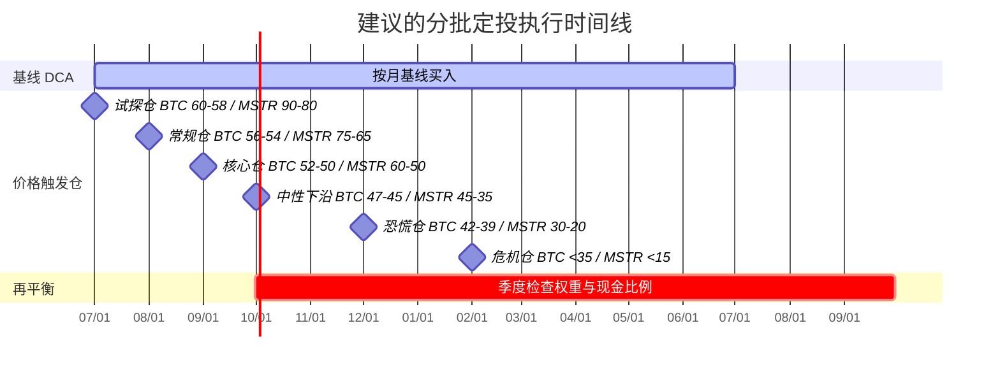

# BTC 与 MSTR 本轮熊市低点区间及定投执行报告

**执行摘要。** 截至 2026 年 6 月 26 日，BTC 现价约为 **59,947 美元**，较 2025 年 10 月的历史高点 **126,080 美元** 回撤约 **52.5%**；MSTR 现价约为 **86.8 美元**，已经接近其 **52 周低点 85.0 美元**，较 52 周高点 **457.22 美元** 回撤约 **81.0%**。BTC 的链上结构并没有出现“网络使用崩塌”，活跃地址仍在 **67.6 万**量级，但短期持有人已明显转入浮亏，导数市场也只是“轻度偏空、尚未彻底出清”：期货资金费率均值仍是 **+0.002%**，3 个月滚动基差约 **+2.236%**，1 个月平值期权隐含波动率约 **42.8%**。这意味着市场像是**慢性熊市**而非一次性踩穿式的流动性终局。对 BTC，我把本轮低点核心区间放在 **47,000–54,000 美元**，并把 **32,000–42,000 美元**视为宏观/ETF/矿工/企业融资四重压力叠加时的悲观尾部；对 MSTR，我认为它不是“高贝塔 BTC ETF”，而是**带债务、优先股、ATM 稀释和融资约束的路径依赖权益**，中性低点区间应看 **40–65 美元**，悲观尾部则需防 **12–35 美元**。citeturn5finance1turn15search0turn5finance0turn15search6turn19search0turn24search0turn25search0turn23search0

**结论先行。** 如果你是长期配置者，而不是想抄“一次精确底”，本轮更合理的策略不是一把梭，而是把仓位拆成**预设价位梯度 + 时间基线 DCA + 明确的 MSTR 上限约束**。BTC 可以承受更大的长期权重；MSTR 只适合在你接受“比 BTC 更大波动、更多稀释、更高制度性风险”时作为增强仓位存在。保守型组合我建议 **BTC/MSTR = 80/20**，中性型 **70/30**，激进型也尽量不要超过 **60/40**。若总投入为 **10,000 美元**，更可执行的做法是：**先打一小笔基线仓，剩余资金按价格梯度分 6 批埋伏**，而不是希望一口气猜中最低点。citeturn6view0turn7view0turn9view0turn30view0turn26search16

## 当前市场位置与关键信号

按 CoinGecko 最新研究对“熊市”的定义——**BTC 连续 30 天以上收在 200 日均线下方**——本轮确认熊市已经持续 **233 天**，是自 2014 年以来第 **4 长**的一轮；历史上更长、更深的熊市分别出现在 2018–2019 年和 2022–2023 年，最大回撤分别达到 **-83.6%** 和 **-76.7%**。CoinGecko 同时指出，本轮确认熊市截至 6 月 24 日此前的最大跌幅是 **-51.2%**，属于已确认但仍未达到历史结构熊平均杀伤力的阶段；而用当前现价 59,947 美元对绝对高点 126,080 美元计算，回撤已经扩大到 **约 -52.5%**。citeturn32view0turn15search0turn5finance1

从技术位置看，BTC 的支撑并不是一个点，而是几个重叠区。第一层是 **2022 低点 15,742 美元到 2025 高点 126,080 美元**这一大牛腿的 **61.8% 回撤位约 57,891 美元**；第二层是 Glassnode 的 **聚合 Realized Price 52,453 美元**；第三层是 Glassnode 的持币成本分布中，**-10% 到 0% 区间的成本密集带约 63,157 美元**、**0% 到 20% 区间约 55,107 美元**，这说明 55k–63k 是真实筹码密集区。换句话说，BTC 现在不是在“空气层”里下跌，而是在一个**成本密集带上方反复测试**。citeturn32view0turn15search0turn16search2turn5finance1

再往链上看，市场并没有出现典型的“长期持有人也全面投降”。Glassnode 显示，BTC 最新 **NUPL 为 0.107**，整体仍有未实现利润；但 **STH-NUPL 为 -0.169**，表明短期持有人整体已转入浮亏，而长期持有人 NUPL 仍为正值。与此同时，BTC 过去 24 小时活跃地址约 **676,389**，活跃实体约 **206,342**，说明链上参与度仍在，只是承担亏损的主要是新近买入者。这个结构通常对应的不是“最后一跌已经结束”，而是“市场正在从分配转向再定价”。citeturn33search0turn33search6turn33search4turn19search0turn19search3

衍生品给出的信号也偏向同一结论。Glassnode 最新数据显示，BTC 永续合约资金费率跨交易所均值约 **+0.002%**，3 个月滚动年化基差约 **+2.236%**，期权 ATM 隐含波动率为 **1 周 42.31%、1 个月 42.82%、3 个月 42.83%、6 个月 43.86%**。这说明市场虽然偏空，但还没有进入“深度负资金费率 + 全面逆价差”的终局恐慌。Glassnode 周报还指出，6 月下旬一度出现**隐含波动率低于实现波动率**的负波动风险溢价，表明市场对下跌仍有补定价需求。citeturn24search0turn25search0turn23search0turn2search7

矿工侧也没有给出“已经完全出清”的典型底部确认。Glassnode 的 Hash Ribbon 最新值显示，**30 日均值约 929 EH/s，60 日均值约 953 EH/s**，仍是 30D 低于 60D 的状态；按该指标原理，真正对底部更友好的信号是 30D 再次上穿 60D，意味着矿工投降阶段结束。也就是说，矿工压力目前更像是**尚未完全解除**，这会抬高 BTC 在 50k 上方震荡反复的概率。citeturn18search1

资金流层面，现货 ETF 和机构风险偏好并不友好。VanEck 在 6 月中旬的链上周报提到，美股现货 BTC ETF 在短时间内出现了**约 50 亿美元累计净流出**；Glassnode 的 6 月 25 日 ETF流量页也显示，最新可见更新中 **IBIT -4,486 BTC、GBTC -913 BTC、ARKB -1,386 BTC、EZBC -116 BTC**，虽然总值因部分发行人延迟更新暂显示为 0，但成分券本身已经表明卖压集中在主流 ETF 端。Reuters 同时指出，2026 年以来 BTC 面临“AI/大型 IPO 吸走风险资金”的宏观风格切换，这是本轮熊市与 2022 年信用塌缩逻辑不同、但同样危险的地方。citeturn16search7turn18search0turn15news31turn20news38

MSTR 的位置比 BTC 更复杂。它现在并不是简单地“跟着 BTC 跌”，而是在经历**BTC 下跌 + 融资能力受质疑 + 优先股价格下跌 + 后续稀释预期抬升**的多重压缩。公司在 6 月 22 日 8-K 中披露，截至 **6 月 21 日持有 847,363 BTC**，总成本 **641.0 亿美元**，平均成本 **75,651 美元/枚**，USD reserve 为 **14 亿美元**；5 月 25 日披露的未偿付资本结构包括 **67 亿美元可转债**和 **155 亿美元优先股名义本金**。同时，公司在 6 月中旬一周内又出售了 **271.48 万股 MSTR**，净募资 **3.355 亿美元**，用以买入 **520 BTC**，并且 MSTR ATM 仍有 **254.11 亿美元**可继续发行。按当前股价粗算，这部分额度理论上相当于**约 2.93 亿股新股**，接近当前基本股本 **3.589 亿股**的 **82%**。这不是“遥远尾部”，这是 MSTR 估值必须贴现的现实变量。citeturn6view0turn4search5turn4search6turn5finance0

更重要的是，Strategy 自己在 2026 年一季报里明确写道：其软件业务产生的现金和现金等价物**不足以满足短期或长期流动性需要**，预计将依赖 USD reserve、**出售比特币**、出售普通股/优先股 ATM，以及进一步债务或股权融资来满足流动性需求。也就是说，MSTR 的下行逻辑不是抽象的“情绪风险”，而是官方文件已经承认的**融资依赖型资产负债表**。这就是为什么我不建议把 MSTR 当成 BTC 的平替，而只能把它当作“高风险增强器”。citeturn7view0

## 低点测算框架与关键假设

对 BTC，我采用的是**三层叠加法**。第一层是**历史熊市分布**：CoinGecko 的 2014–2026 研究显示，结构性熊市的最大跌幅主要落在 **-76.7% 到 -83.6%**，而类似“中周期修正”的熊市大约在 **-52.9% 到 -66.3%**。第二层是**技术与链上重叠支撑**：61.8% 大级别回撤位约 **57.9k**，Glassnode 聚合 Realized Price 约 **52.45k**，UTXO 成本密集带约 **55.1k/63.2k**，以及大额钱包的成本带约 **49k–62k**。第三层是**波动率与 VaR**：以当前 BTC 价格 **59,947 美元**和 1 个月 ATM IV **42.82%**做线性近似，1 个月 **95% VaR**大致在 **-20%** 左右，对应价格约 **47.7k**；这条线与中性情景下沿高度一致。citeturn32view0turn15search0turn16search2turn17search4turn23search0turn5finance1

对 MSTR，我不用单纯的历史股价回撤去猜底，而是用**“BTC 场景映射 + 简化剩余普通股净值 + 稀释贴现”**来估。输入是公开披露的 **847,363 BTC 持仓**、**14 亿美元 USD reserve**、**67 亿美元可转债**、**155 亿美元优先股名义本金**、以及 **3.589 亿基本股本**。按这个极简框架，若 BTC 分别在 **60k / 52.5k / 45k / 32k**，则对应的简化普通股剩余价值约为 **83.7 / 66.0 / 48.3 / 17.6 美元/股**。再考虑 MSTR 当前高达 **96%** 的官方期权隐含波动率、持续 ATM 融资、优先股分红负担和市场对融资链条稳定性的怀疑，现实交易价格通常会围绕这个值上下大幅偏离。因此，MSTR 的“底”更像一个**区间**，不是一个清晰点位。citeturn6view0turn4search5turn4search6turn26search16turn5finance1

技术指标的使用上，我把它们当成**入场节奏工具**，不是方向决定器。BTC 的公开技术页在 6 月 26 日出现明显口径分歧：Investing 的日线 RSI 大约在 **50** 附近、MACD 为负，偏“弱中性”；Barchart 的 BTCUSD 技术页则给出 14 日“Relative Strength”约 **31.3**，更接近超卖。但这两个来源都指向同一件事：**MACD 仍偏空，价格仍在主要均线之下**。MSTR 的信号则更整齐：Barchart 给出的 **50/100/200 日均线约 150.6 / 141.6 / 186.0 美元**，远高于现价；14 日相对强弱约 **23.8**，明显超卖；Investing 对 MSTR 的 14 日 RSI 也给出 **约 23–24**，MACD 为负。我的处理原则因此是：BTC 用“区间吸纳”，MSTR 用“深跌分层 + 总仓位上限”。citeturn27search1turn29view0turn30view0turn22search3

需要提前说明的，是本报告里所有“概率”都不是频率学意义上的客观真值，而是**基于公开数据的主观贝叶斯权重**。它的价值不在于“预言”，而在于帮助你把仓位管理从情绪化改成条件化。这个区别很大：前者要求你猜对，后者要求你别死。citeturn32view0turn7view0

## BTC 低点区间判断

下表给出的区间，可视为我基于历史回撤、链上成本结构、波动率和当前资金流状态给出的**主观 60% 情景置信带**，并非“最低点单点预测”。

| 情景 | 低点区间 | 发生概率 | 触及时间窗口 | 我对这个区间的理解 |
|---|---:|---:|---|---|
| 乐观 | **55,000 – 60,000** | **30%** | **0–3 个月** | 61.8% 大回撤位与 55k–63k 成本密集带守住，ETF 流出放缓，矿工压力不再恶化 |
| 中性 | **47,000 – 54,000** | **45%** | **1–6 个月** | Realized Price 一带被回踩，1 个月 95% VaR 对应下沿，市场完成中等强度再定价 |
| 悲观 | **32,000 – 42,000** | **25%** | **3–12 个月** | 逼近 78.6% 回撤位与历史结构熊中位区域，需要宏观流动性/ETF/矿工/信用链同时恶化 |

表中区间的输入锚点分别是：当前价 **59,947** 美元、2025 绝对高点 **126,080** 美元、2022 周期低点 **15,742** 美元、Realized Price **52,453** 美元、成本密集区 **55,107/63,157** 美元、以及 1 个月 ATM IV **42.82%**。用这些输入计算，61.8% 回撤位约 **57.9k**，78.6% 位约 **39.4k**，1 个月 95% VaR 约给出 **47.7k** 的风险下沿，因此中性区间落在 **47k–54k** 不是拍脑袋，而是多个框架重合后的结果。citeturn5finance1turn15search0turn32view0turn16search2turn23search0

我之所以没有把 **50k 以下**直接定义为“极端小概率”，是因为当前熊市虽然已经确认，但衍生品并没有完成传统意义上的终局出清：资金费率仍是小幅正值，基差仍是正值，Hash Ribbon 也还没回到更强的“投降后修复”结构。再加上 Reuters 和 VanEck 都提到的 ETF 流出与风格切换压力，**47k–54k** 这个再定价带比市场主流口头上的“60k 铁底”更可信。citeturn24search0turn25search0turn18search1turn15news31turn16search7

但我也没有把 **30k 附近**当作基准情景，因为链上并未出现 2022 年那种系统信用塌陷。Glassnode 显示，6 月以来有超过 **259,298 BTC** 的净买入力量出现在 **59k–67k** 区间；活跃地址和活跃实体仍然保持在高位，意味着当前更像是**高位套牢区重建筹码**，而不是“全网无人接盘”。因此悲观情景需要额外条件触发：例如 ETF 持续大额流出、矿工压力恶化、宏观利率预期再上修、或大型 BTC 财库公司被迫进一步处置资产。citeturn16search11turn19search0turn19search3turn7view0

## MSTR 低点区间判断

MSTR 的底不能只用 K 线看，因为它的下行驱动里掺了四个变量：**BTC 价格、ATM 稀释速度、优先股/可转债融资成本、以及市场是否继续给它融资链条“路径依赖溢价”**。因此，我把 MSTR 的三种低点情景直接绑定到 BTC 的三种场景上。

| 情景 | 低点区间 | 发生概率 | 触及时间窗口 | 关键触发条件 |
|---|---:|---:|---|---|
| 乐观 | **68 – 90 美元** | **25%** | **0–3 个月** | BTC 守住 55k 上方；市场认为 MSTR 已接近简化残余净值；稀释速度放缓 |
| 中性 | **40 – 65 美元** | **50%** | **1–6 个月** | BTC 回踩 47k–54k；ATM 继续、优先股承压；股权按残余净值再打 10%–25% 折价 |
| 悲观 | **12 – 35 美元** | **25%** | **3–12 个月** | BTC 下探 32k–42k；融资链条恶化；市场开始按更重折扣计价后续稀释与流动性风险 |

这个区间不是凭历史高点回撤瞎猜出来的，而是用当前公开资本结构反推。以 **847,363 BTC**、**14 亿美元 reserve**、**67 亿美元可转债**、**155 亿美元优先股**、**3.589 亿股基本股本**为输入，简化普通股残余价值在 BTC **60k / 52.5k / 45k / 32k** 时约等于 **83.7 / 66.0 / 48.3 / 17.6 美元/股**。当前现价 **86.8 美元**基本只是在这个残余净值附近；一旦 BTC 再跌，而公司同时继续用普通股融资买币，市场很容易在净值基础上再打折，所以中性场景的 **40–65** 美元是有资产负债表支撑的。citeturn6view0turn4search5turn4search6turn5finance0turn5finance1

再看市场定价本身，MSTR 的技术面几乎已经写明“高波动 + 超卖 + 仍未企稳”。Barchart 的公开页显示，MSTR **50/100/200 日均线约为 150.56 / 141.55 / 185.96 美元**，目前价格远低于所有中长期均线；14 日相对强弱约 **23.81**，14 日历史波动率约 **80.88%**。Strategy 官方期权指标页还给出 **96% 隐含波动率**和约 **0.95 的 Put/Call 比**。这说明 MSTR 确实可能出现剧烈反抽，但这不等于底部已完成；它只说明市场已经在为**大波动**付钱。citeturn30view0turn26search16

真正让我对 MSTR 比对 BTC 更保守的，是它的现金流与稀释路径。公司一季报写得很直接：现有软件经营现金流不足以覆盖短期和长期流动性需求，公司预期依赖 USD reserve、出售 BTC、出售普通股/优先股 ATM 以及进一步融资。与此同时，公司 6 月 22 日披露的 **MSTR 普通股仍有 254.11 亿美元可供发行**。如果你把这件事想清楚，就会知道：**MSTR 下跌并不需要公司“爆雷”，只需要市场相信稀释会持续发生**。这就是为什么我认为中性场景的概率应该高于乐观场景。citeturn7view0turn6view0

## 定投与风控执行方案

先给我的核心建议：**BTC 做底仓，MSTR 做增强；MSTR 永远不要反客为主。** 如果你未指定期限与总本金，我建议你把资金分成两部分：一部分用于按月/按周的**基线 DCA**，保证你不会完全错过市场；另一部分作为**价格触发仓**，专门等市场跌进关键支撑带再出手。这样做的优点，是既不需要猜底，也不会在下跌初段很快把子弹打光。

### 风险偏好与总仓位分配

| 风险偏好 | BTC 权重 | MSTR 权重 | 现金/预备金思路 | 适合什么人 |
|---|---:|---:|---|---|
| 保守 | **80%** | **20%** | 至少保留 20% 价格触发弹药到最后两档 | 更看重长期生存，不追求弹性极值 |
| 中性 | **70%** | **30%** | 保留 25%–30% 资金只在中性/悲观区间使用 | 接受波动，但不想被单一公司结构拖垮 |
| 激进 | **60%** | **40%** | 允许更深回撤，但 MSTR 绝不再上调权重 | 能承受高波动，愿意用 MSTR 换更高弹性 |

这个分配背后的逻辑很简单：BTC 是底层资产，MSTR 是带融资杠杆和稀释约束的权益壳。公开数据已经显示 MSTR 的价格、波动率和资本结构都比 BTC 更脆弱，因此即便是激进型，我也不建议把 MSTR 提到 **40% 以上**。citeturn5finance0turn5finance1turn7view0turn26search16

### 价格触发梯度

下面的梯度适用于“该资产自身分配到的资金”，不是总资金。也就是说，若你是中性型、总资金 10,000 美元，则 BTC 资金池是 7,000 美元，MSTR 资金池是 3,000 美元，下面的百分比就是对这两个资金池分别生效。

#### BTC 梯度

| BTC 价格区间 | 对 BTC 资金池的投入比例 | 规则说明 |
|---|---:|---|
| **60k – 58k** | **10%** | 只打试探仓，确认你开始参与 |
| **56k – 54k** | **15%** | 接近链上成本密集带中枢，开始正常吸纳 |
| **52k – 50k** | **20%** | 接近 Realized Price，属于优先配置区 |
| **47k – 45k** | **20%** | 接近 1 个月 95% VaR 下沿与中性情景下沿 |
| **42k – 39k** | **20%** | 接近 78.6% 大回撤带，属于恐慌配置区 |
| **35k 以下** | **15%** | 只在悲观尾部才动用的危机仓 |

#### MSTR 梯度

| MSTR 价格区间 | 对 MSTR 资金池的投入比例 | 规则说明 |
|---|---:|---|
| **90 – 80** | **10%** | 仅试探，不追反弹 |
| **75 – 65** | **15%** | 接近乐观底部范围，可开始建立增强仓 |
| **60 – 50** | **20%** | 对应 BTC 中性下探初段，性价比开始改善 |
| **45 – 35** | **25%** | 中性情景核心配置区，但必须确认你能承受再跌 |
| **30 – 20** | **20%** | 融资链条被严重贴现时的高风险高收益区 |
| **15 以下** | **10%** | 纯尾部危机仓，只能用你愿意承受永久亏损的钱 |

这些触发位不是任意挑的：BTC 梯度围绕 **57.9k Fib、52.45k Realized Price、47.7k VaR 下沿、39.4k 78.6% 回撤位**展开；MSTR 梯度则是把 BTC 情景映射到简化普通股残余净值附近，再叠加一层稀释折价。citeturn15search0turn32view0turn16search2turn23search0turn6view0turn4search6

### 以 10,000 美元总投入举例

若采用上述三类风险偏好，**有限总投入**的可执行版本如下：

| 风险偏好 | BTC 配额 | MSTR 配额 | 初始基线买入 | 剩余触发资金 |
|---|---:|---:|---:|---:|
| 保守 | **8,000** | **2,000** | 先买总额 **15%** | **85%** 按梯度执行 |
| 中性 | **7,000** | **3,000** | 先买总额 **20%** | **80%** 按梯度执行 |
| 激进 | **6,000** | **4,000** | 先买总额 **25%** | **75%** 按梯度执行 |

以中性型为例，你可以今天先买 **2,000 美元**，其中 **BTC 1,400 / MSTR 600**；剩余 **8,000 美元**完全按上面的价格梯度走。如此设计有两个作用：第一，你不会因为市场突然 V 反而完全没筹码；第二，你也不会在 60k 上方就把未来该在 50k、45k、39k 才用的钱用光。citeturn5finance0turn5finance1turn16search2turn6view0

### 无固定到期的长期定投版本

如果你并不是一次性 10,000 美元，而是想做**无固定到期的长期 DCA**，我建议把年度预算记作 **B**，然后按下面的比例执行：

- **60% 的 B** 做时间型 DCA：按月投入，即每月投入 **B / 20** 左右。
- **40% 的 B** 做价格触发仓：完全沿用上面的 BTC/MSTR 梯度。
- 若连续 **3 个月**都没有触发更低价位，则把价格触发仓中尚未动用的部分，按月释放 **1/6** 回到时间型 DCA，避免资金长期空转。

例如你计划未来一年投入 12,000 美元，中性型配置下可以把 **7,200 美元**做基线月投，月均约 **600 美元**；另外 **4,800 美元**只在跌到预设档位时投入。这个做法比单纯“每月固定买同样金额”更适合现在这种**确认熊市但尚未终局出清**的环境。citeturn32view0turn24search0turn25search0

### 加仓、减仓与再平衡规则

加仓规则我建议尽量机械化。BTC 方面，只要价格进入下一档位，就执行对应档位，不讨论“会不会更低”；MSTR 方面必须额外加一条：**如果 BTC 周线有效跌破 47k，而 Strategy 继续大额 ATM 融资，暂停所有新的 MSTR 加仓，只允许加 BTC。** 因为那时 MSTR 的风险不再只是市场波动，而是资金链与稀释链条同步恶化。citeturn6view0turn7view0turn5finance1

减仓规则不应设置在“刚盈利就卖”，而应设置在**结构恢复**时。我的建议是：当 BTC 重新站上并稳定在其主要中长期均线之上，且 ETF 流出明显减速后，停止使用“价格触发仓”，只保留时间 DCA；当 MSTR 因反弹使其在组合中的权重**高出目标权重 10 个百分点以上**，把超出的那部分逐步换回 BTC 或现金。原因很简单：MSTR 更适合拿来放大底部弹性，不适合在市场重回上行后让它无节制吞噬你的组合风控。citeturn32view0turn18search0turn30view0

止损我更倾向于做**资本止损**，不是机械价格止损。对长期 BTC 现货来说，硬止损常常把你自己踢出本该持有的底部区间，所以我不建议用单一价格止损；但对 MSTR，我建议设“软止损条件”：若 **BTC < 45k** 且公司继续扩大普通股/优先股融资，或者优先股价格持续远离面值导致融资成本明显恶化，则把 MSTR 仓位**减 1/3 到 1/2**，转回 BTC 或现金。这个规则不是为了猜顶，而是为了避免一个本来只该是“增强仓”的东西，在最坏阶段吞掉整个组合。citeturn4search5turn6view0turn7view0turn21news36



## 复现图表、关键参数与数据来源

本报告实际用到的核心参数如下：BTC 现价 **59,947 美元**，MSTR 现价 **86.8 美元**；BTC 绝对高点 **126,080 美元**，2022 周期低点 **15,742 美元**；BTC Realized Price **52,453 美元**；BTC 1 个月 ATM IV **42.82%**；Strategy 持有 **847,363 BTC**，平均持仓成本 **75,651 美元**，USD reserve **14 亿美元**，可转债约 **67 亿美元**，优先股名义本金约 **155 亿美元**，基本股本约 **3.589 亿股**。技术指标中的 RSI/MACD/MA 因官方并不统一提供，BTC 采用了 Investing/Barchart 的公开技术页交叉校验，MSTR 采用 Barchart 与 Investing 辅助。citeturn5finance1turn5finance0turn15search0turn32view0turn16search2turn23search0turn6view0turn4search5turn4search6turn27search1turn30view0turn22search3

如果你想把本报告里的图——包括**价格 + 均线 + RSI/MACD 时间序列图**、**回撤分布直方图**、**情景比较图**——完整复现，下面这段 Python 脚本是最省事的做法。价格部分用 `yfinance` 拉 **BTC-USD** 与 **MSTR** 的 5 年日线；链上部分建议你从 Glassnode 对应公开图页导出 CSV 后放到本地读入，因为 Glassnode 很多链上指标的 API 需要权限，而公开页面本身已经说明了指标定义和最新值。citeturn15search11turn14search1turn11search0turn1search0turn23search0

```python
# pip install yfinance pandas numpy matplotlib plotly

import numpy as np
import pandas as pd
import yfinance as yf
import matplotlib.pyplot as plt

START = "2021-06-26"
END   = "2026-06-26"

def rsi(series: pd.Series, n: int = 14) -> pd.Series:
    delta = series.diff()
    gain = delta.clip(lower=0)
    loss = -delta.clip(upper=0)
    avg_gain = gain.ewm(alpha=1/n, adjust=False).mean()
    avg_loss = loss.ewm(alpha=1/n, adjust=False).mean()
    rs = avg_gain / avg_loss.replace(0, np.nan)
    return 100 - (100 / (1 + rs))

def macd(series: pd.Series, fast=12, slow=26, signal=9):
    ema_fast = series.ewm(span=fast, adjust=False).mean()
    ema_slow = series.ewm(span=slow, adjust=False).mean()
    macd_line = ema_fast - ema_slow
    signal_line = macd_line.ewm(span=signal, adjust=False).mean()
    hist = macd_line - signal_line
    return macd_line, signal_line, hist

def add_indicators(df: pd.DataFrame) -> pd.DataFrame:
    out = df.copy()
    out["MA50"] = out["Close"].rolling(50).mean()
    out["MA100"] = out["Close"].rolling(100).mean()
    out["MA200"] = out["Close"].rolling(200).mean()
    out["RSI14"] = rsi(out["Close"], 14)
    out["MACD"], out["MACD_SIGNAL"], out["MACD_HIST"] = macd(out["Close"])
    out["RET"] = out["Close"].pct_change()
    out["DD"] = out["Close"] / out["Close"].cummax() - 1
    out["VOL20_ANN"] = out["RET"].rolling(20).std() * np.sqrt(252)
    return out

# 下载价格
btc = yf.download("BTC-USD", start=START, end=END, auto_adjust=False, progress=False)
mstr = yf.download("MSTR", start=START, end=END, auto_adjust=False, progress=False)

# 某些 yfinance 版本会返回多级列
if isinstance(btc.columns, pd.MultiIndex):
    btc.columns = btc.columns.get_level_values(0)
if isinstance(mstr.columns, pd.MultiIndex):
    mstr.columns = mstr.columns.get_level_values(0)

btc = add_indicators(btc)
mstr = add_indicators(mstr)

# 可选：读入你从 Glassnode 导出的 CSV
# active_addr = pd.read_csv("glassnode_active_addresses_btc.csv")
# nupl = pd.read_csv("glassnode_btc_nupl.csv")
# realized_price = pd.read_csv("glassnode_btc_realized_price.csv")
# funding = pd.read_csv("glassnode_btc_funding.csv")
# basis = pd.read_csv("glassnode_btc_3m_basis.csv")
# iv = pd.read_csv("glassnode_btc_options_iv.csv")

# 价格 + 均线图
def plot_price_ma(df: pd.DataFrame, title: str):
    fig, ax = plt.subplots(figsize=(13, 6))
    ax.plot(df.index, df["Close"], label="Close")
    ax.plot(df.index, df["MA50"], label="MA50")
    ax.plot(df.index, df["MA100"], label="MA100")
    ax.plot(df.index, df["MA200"], label="MA200")
    ax.set_title(title)
    ax.legend()
    ax.grid(True)
    plt.tight_layout()
    plt.show()

plot_price_ma(btc, "BTC Price with MA50/100/200")
plot_price_ma(mstr, "MSTR Price with MA50/100/200")

# RSI + MACD 图
def plot_rsi_macd(df: pd.DataFrame, title: str):
    fig = plt.figure(figsize=(13, 8))
    ax1 = fig.add_subplot(211)
    ax1.plot(df.index, df["RSI14"], label="RSI14")
    ax1.axhline(70, linestyle="--")
    ax1.axhline(30, linestyle="--")
    ax1.set_title(f"{title} - RSI14")
    ax1.grid(True)

    ax2 = fig.add_subplot(212)
    ax2.plot(df.index, df["MACD"], label="MACD")
    ax2.plot(df.index, df["MACD_SIGNAL"], label="Signal")
    ax2.bar(df.index, df["MACD_HIST"], width=2, label="Hist")
    ax2.set_title(f"{title} - MACD")
    ax2.legend()
    ax2.grid(True)
    plt.tight_layout()
    plt.show()

plot_rsi_macd(btc, "BTC")
plot_rsi_macd(mstr, "MSTR")

# 回撤分布直方图
def plot_drawdown_hist(df: pd.DataFrame, title: str):
    dd = df["DD"].dropna()
    fig, ax = plt.subplots(figsize=(10, 5))
    ax.hist(dd, bins=50)
    ax.set_title(f"{title} Drawdown Histogram")
    ax.set_xlabel("Drawdown")
    ax.set_ylabel("Frequency")
    ax.grid(True)
    plt.tight_layout()
    plt.show()

plot_drawdown_hist(btc, "BTC")
plot_drawdown_hist(mstr, "MSTR")

# 情景测算
BTC_HOLDINGS = 847_363
USD_RESERVE = 1.4e9
DEBT_PREF = 22.2e9
BASIC_SHARES = 358_892_000

btc_scenarios = {
    "optimistic": (55000, 60000),
    "base":       (47000, 54000),
    "bearish":    (32000, 42000),
}

rows = []
for name, (lo, hi) in btc_scenarios.items():
    for p in [lo, hi]:
        residual_equity = BTC_HOLDINGS * p + USD_RESERVE - DEBT_PREF
        residual_per_share = residual_equity / BASIC_SHARES
        rows.append([name, p, residual_equity / 1e9, residual_per_share])

scenario_df = pd.DataFrame(rows, columns=["scenario", "BTC_price", "residual_equity_bn", "residual_per_share"])
print(scenario_df)

# 线性近似 VaR
def one_month_var(price, annual_iv, z=1.65):
    return price * annual_iv * np.sqrt(1/12) * z

print("BTC 1M 95% VaR:", one_month_var(59947, 0.4282))
print("MSTR 1M 95% VaR:", one_month_var(86.8, 0.96))
```

如果你更习惯 Excel，而不是 Python，那么只需要抓 5 年日线到表格中，再用以下公式即可：
`MA50 = AVERAGE(最近50个收盘价)`；`MA100` 和 `MA200` 同理；
`RSI14` 可用 Wilder 平滑法；
`MACD = EMA12 - EMA26`，`Signal = EMA(MACD, 9)`；
`Drawdown = 当前收盘价 / 历史滚动最高收盘价 - 1`。
这些都是标准技术指标，差异只来自数据源口径，而不是公式本身。citeturn27news29

## 风险与模型局限

最主要的风险，不是“价格波动”本身，而是**路径依赖**。BTC 如果慢慢跌，和 BTC 如果带着 ETF 流出、矿工压力、宏观利率再定价一起急跌，对 MSTR 的结果完全不同。因为 MSTR 官方已经说明，其流动性需求在相当程度上依赖于 reserve、出售 BTC、ATM 和进一步融资；而 Glassnode 也明确提示，交易所标签类指标会随着标签更新而修订，ETF 总流量也会因发行人更新时点不一致而出现延迟。因此，这份报告里的很多结论应被理解为**条件判断**，不是静态结论。citeturn7view0turn1search1turn18search0

第二个局限是技术指标口径。你已经在上文看到，BTC 的 50/100/200 日均线、RSI、MACD 在 Investing、Barchart、CoinGecko 研究和新闻稿之间并不完全一致。这不是谁一定错，而是不同平台采用的**交易所组合、收盘时点、是否用指数合成、是否滚动更新到盘中**都可能不同。所以我的做法是：**只把它们当区间与方向工具，不把它们当作单点真理**。citeturn27search1turn29view0turn32view0

第三个局限是 MSTR 的资本结构并不适合用一个“精确估值公式”处理。优先股有分红条款、嵌入式衍生特征、未来发行可能，Strategy 也明确警示优先股发行会进一步劣后普通股。所以上文使用的“简化剩余普通股净值”只是为了识别**底部区间和风险传导方向**，而不是为了给出一个你可以拿去贴现到分的绝对内在价值。对 MSTR，最危险的错误不是估值算错 10%，而是忘了它首先是一家**持续融资的 BTC 财库公司**，而不是纯现货持有器。citeturn7view3turn6view0turn9view0

最后，真正决定你结果的，不会是我给出的区间中枢，而是你有没有能力在错误的时间里不把仓位打光。市场不会奖励“看对一次的人”，它只会奖励“在多次不确定性里还能活下来的人”。

navlist近期关键报道turn0news37,turn21news36,turn15news31,turn20news38,turn14news30